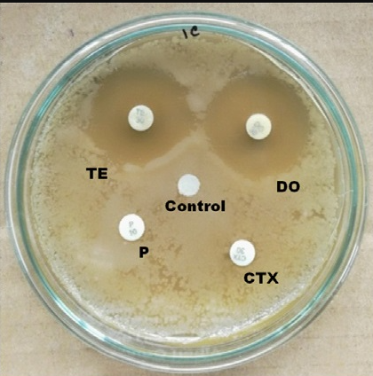
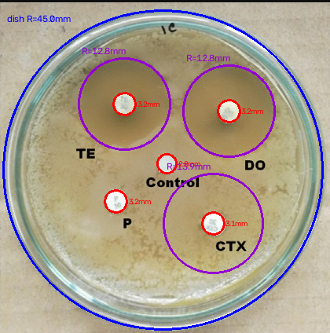
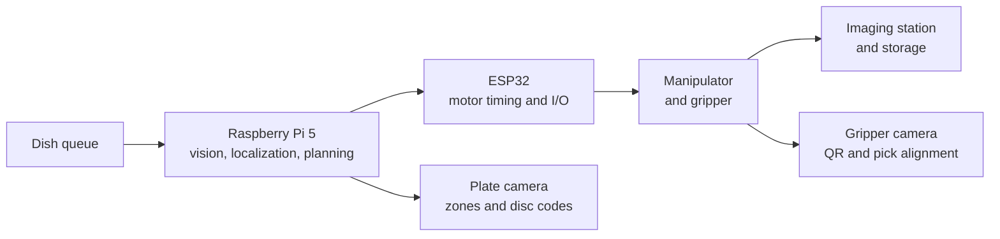
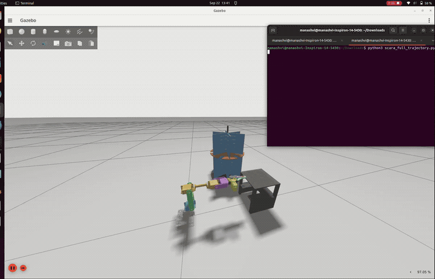
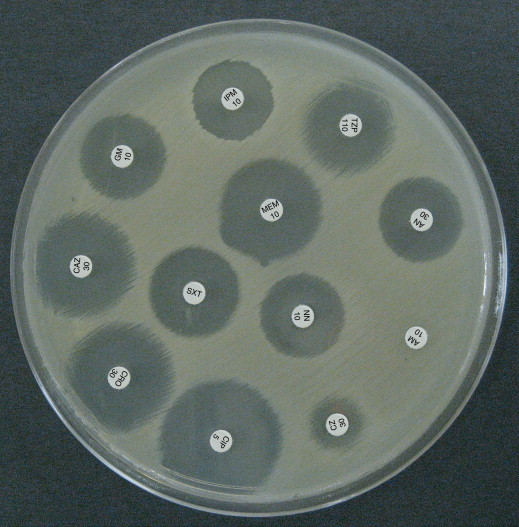
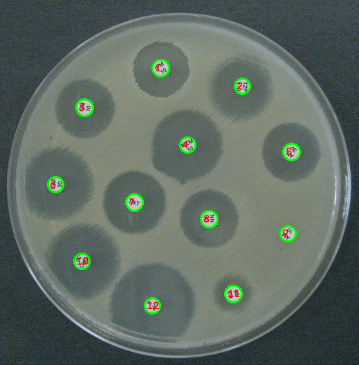
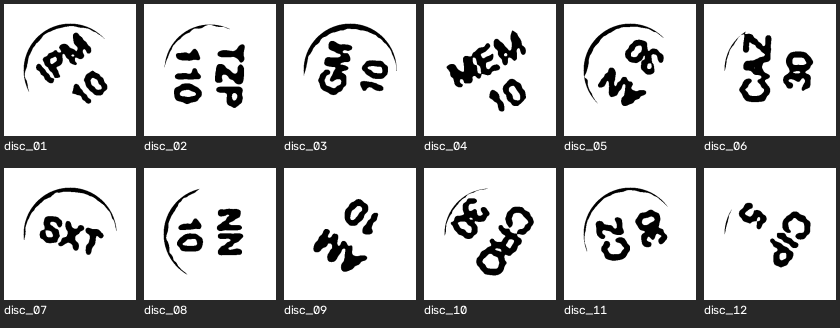
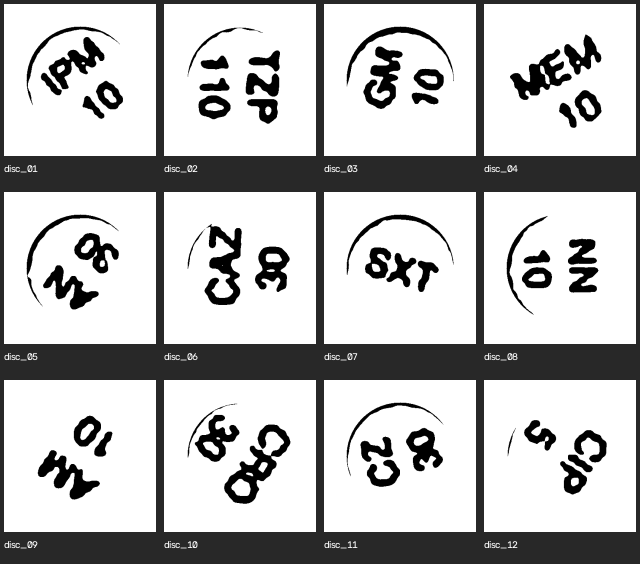
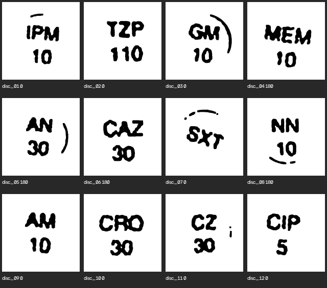
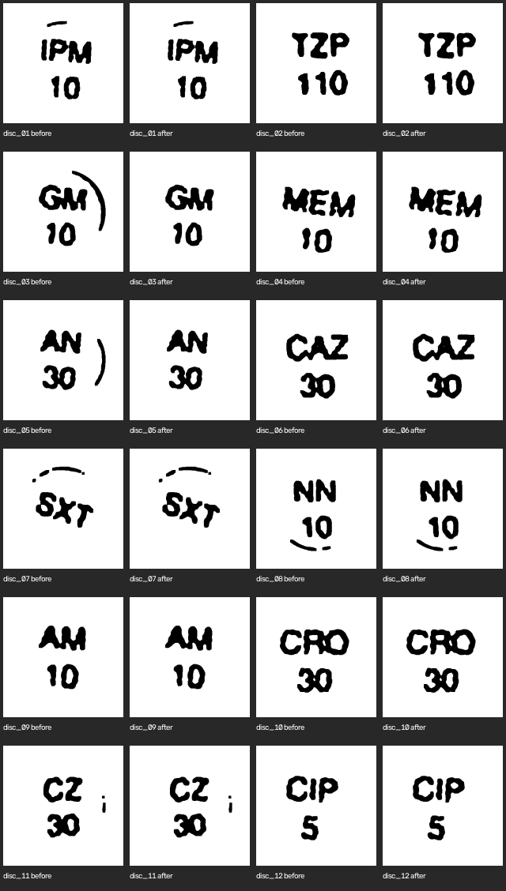

# PetriOS

**Autonomous robotic manipulator for AMR sampling.**

PetriOS automates the repetitive laboratory half of antimicrobial-resistance surveillance: move a Petri dish, image it under controlled light, measure inhibition zones, and read the antibiotic code stamped on each Kirby–Bauer disc.

ELD411 mid-term review, 2026 · Indian Institute of Technology Delhi  
Arnav Panjla · 2023EE10978 · Manashvi Garg · 2023EE1141

<p align="center">
  
  &nbsp;
  
</p>

<p align="center"><i>OpenCV baseline on a 90 mm plate. Blue is the dish (R = 45 mm). Red is a disc. Purple is a measured zone. The blank control has no zone, which is a result.</i></p>

## The bottleneck

Village sampling feeds a central lab. The lab work that does not scale is moving dishes, imaging them, and logging what was on the plate.

| Step | What happens today |
|------|--------------------|
| Villages | Distributed sampling |
| Collection | Repeated field visits |
| Laboratory | Central processing |
| Dishes | Manual handling and imaging |
| Bottleneck | The same motions, every dish |

The objective is autonomous Petri-dish handling plus controlled imaging, at about **100 dishes per day**.

## Design load

These are planning numbers for storage and robot duty cycle. The 2–5% sampling fraction is a project assumption, not an epidemiological estimate.

| Input | Value |
|-------|--------|
| Village size | ~100 people |
| Sampling fraction | 2–5% → 2–5 samples per village |
| Field collectors | 4–5 |
| Villages per collector per day | 5–6 |
| Incoming dishes | **~100 / day** |
| Time a dish stays in process | 5–6 days |
| In-process capacity | **~500–600 dishes** |

Day 1 holds 100 dishes. By day 6 the pipeline is holding about 600, because earlier batches are still incubating.

## System

Perception and motion are split. The Pi decides what and where. A real-time controller decides when and how.



| Layer | Hardware | Job |
|-------|----------|-----|
| Computation | Raspberry Pi 5 | Computer vision, planning, camera interface |
| Control | ESP32 (Zephyr is the integration target; current code is Arduino) | Motor timing, limit inputs, command execution |
| Actuation | Drivers, motors, manipulator, gripper | Pick, transfer, place |
| Imaging | 12 MP Camera Module 3, diffused light | Plate capture |
| Identity | ESP32-CAM on the gripper | QR or barcode before pickup |
| Storage | Carousel or chamber | Queue of dishes under controlled conditions |

Pick-and-place closes the loop after the grip, not only before it:

1. Capture
2. Detect the dish
3. Localize `x, y, θ`
4. Transform camera coordinates into the robot frame
5. Plan a collision-aware path
6. Approach
7. Grip and confirm the hold
8. Transfer
9. Release
10. Verify, then retry or escalate

The revised mid-term deck moves the arm from the original SCARA bill of materials to a **6-DOF arm** with longer links for carousel reach, a rigid camera mount above the gripper, and cable routing for CSI and power. Torque, stiffness, and collisions still have to be rechecked after the link change.

### Gazebo

The arm beside the dish carousel, at **2×** (source clip 2:08, this copy 1:04). GitHub plays the GIF inline. The full-resolution file is [`assets/gazebo-sim-2x.mp4`](assets/gazebo-sim-2x.mp4). The URDF and world file are not checked in yet.



Details: [system architecture](research/02-system-architecture.md).

## Vision

Image processing is two separate jobs. Zone measurement does not read the stamp, and stamp reading does not measure the zone.

### Part A — dish, discs, and zone diameter

`vision/petri_detect.py` finds the dish rim, the white paper discs, and each zone of inhibition. Measurements are anchored to the known 90 mm dish so the detector is not guessing from pixel fractions.

```bash
python3 vision/petri_detect.py vision/sample/s1.png
# writes vision/sample/s1_detected.png
```

More annotated plates are in [`vision/sample/`](vision/sample/).

### Part B — antibiotic code and dose

Each disc is stamped with a short code and, usually, a dose in µg (`GM 10`, `TZP 110`, `SXT`). The stamp is thick, embossed, and can sit at any angle. Classical page OCR expects thin horizontal type, so the pipeline uprights the stamp with geometry and only then asks a local vision-language model to read it.

The plate below is `test1.png`: 12 discs, ground truth read by eye.

<p align="center">
  
</p>

Hough circles locate every disc. Otsu then paints the agar white and the stamp black.

<p align="center">
  
  &nbsp;
  
</p>

One-shot deskew (PCA, Hough lines, projection profiles) locks onto a single fat stroke instead of the line of text. The alignment that survived inspection is method C: two-line centroids, code row versus dose row, rotated so the line between those centres is vertical. That still leaves a 180° flip. After a morphological open (5×5, two iterations) separates touching strokes, the upright rule is the way these discs are printed: letters above, digits below.

<p align="center">
  
  &nbsp;
  
</p>

Leftover rim ink looks like an extra letter (`GM` read as `GMI`). Stripping rim blobs that are not part of the letter mass, without cropping the glyphs, is what made the last reader hold.

<p align="center">
  
</p>

Local **Gemma 3 4B** (Ollama, offline after the model is pulled) reads the native upright crop. Blowing the crop up to 896×896 with nearest-neighbour zoom swapped `TZP` into `ZTP`. There is no antibiotic-name dictionary: a wrong code is kept as a wrong code.

| Disc | Read | Truth |
|------|------|-------|
| 01 | IPM 10 | IPM 10 |
| 02 | TZP 110 | TZP 110 |
| 03 | GM 10 | GM 10 |
| 04 | MEM 10 | MEM 10 |
| 05 | AN 30 | AN 30 |
| 06 | CAZ 30 | CAZ 30 |
| 07 | SXT | SXT |
| 08 | NN 10 | NN 10 |
| 09 | AM 10 | AM 10 |
| 10 | CRO 30 | CRO 30 |
| 11 | CZ 30 | CZ 30 |
| 12 | CIP 5 | CIP 5 |

**12 / 12 on this one plate.** Run order, from [`vision/antibiotic_vision/`](vision/antibiotic_vision/):

```text
extract_binary_discs.py        Hough, then Otsu
align_binary_discs.py          method C — load the saved PNG, do not recompute
morph_stroke_separate.py       open 5×5 × 2
align_letters_above_digits.py  0° versus 180°
ocr_gemma3.py                  rim strip + gemma3:4b
```

Needs Ollama with `gemma3:4b` pulled. EasyOCR is only the 0°/180° layout check.

What else was scored on `test1.png`, so the 12/12 has a denominator:

| Attempt | Score |
|---------|-------|
| EasyOCR on upright 1-bit stamps | 5/12 |
| Tesseract, whole disc | 5/12 |
| Hausdorff templates | 1/12 |
| Gemma at 896 nearest-neighbour zoom | 10/12 |
| Gemma, native crop, rim left on | 11/12 |
| Gemma, native crop, rim stripped | **12/12** |
| Hough on other stock plates | 25 proper circles / 33 real discs |

An earlier 12/12 used a different set of tiny grey crops and a 15° EasyOCR search. That recipe did not transfer to these 1-bit stamps. The two scores are different experiments. Hough radii are tuned to `test1.png`; on other photographs the miss is the detector. There is no single `run_plate.py` yet. The full narrative is [`vision/antibiotic_vision/PROCESS_REPORT.md`](vision/antibiotic_vision/PROCESS_REPORT.md). Slide images live in [`vision/antibiotic_vision/talk_pack/`](vision/antibiotic_vision/talk_pack/).

## Hardware draft

The checked-in bill of materials and power budget are the **SCARA prototype**, written before the revised deck’s 6-DOF arm. Treat the wattage as an envelope to remeasure, not a final supply spec.

| Subsystem | Selected parts |
|-----------|----------------|
| Vision compute | Raspberry Pi 5, 4 GB, 32 GB microSD |
| Plate camera | Camera Module 3, 12 MP |
| Gripper camera | ESP32-CAM |
| Joints | 5× NEMA17 + TMC2209 or A4988, timing belt, 5 limit switches |
| Motion board | Arduino Nano + CNC shield |
| Gripper | Micro servo |
| Carousel | High-torque servo (20 kg·cm class), bearing, dish inserts |
| Power | 12 V stepper rail, 6 V servo rail, 5 V / 6 A logic rail, fuse |

Rough draw: **~95 W typical, ~145 W peak**. Suggested supplies: 12 V at ≥8 A, a separate 6 V servo rail at ≥5 A, and a clean 5 V / 5 A source for the Pi. Detail is in [`hardware/power_budget.md`](hardware/power_budget.md) and [`hardware/BOM.csv`](hardware/BOM.csv).

A 90 mm plate at 5 µm/pixel is about 324 MP in one shot. The 12 MP module cannot do that in a single frame. Tiling on an XY stage, or accepting a coarser pixel for stamp reading, is still an open optics decision. Notes: [`research/01-hardware-specs.md`](research/01-hardware-specs.md).

Pi camera streaming and QR overlay: [`camera/setup.md`](camera/setup.md). ESP32-CAM and stepper sketches: [`esp_codes/`](esp_codes/).

## Where things live

```text
PetriOS/
├── README.md                  this page
├── assets/                    Gazebo clip at 2× (mp4 + gif)
├── research/                  hardware notes and architecture
├── hardware/                  SCARA BOM and power budget
├── camera/                    picamera2 stream, QR, distance frames
├── esp_codes/                 ESP32-CAM and stepper sketches
├── vision/
│   ├── petri_detect.py        dish, disc, and zone measurement
│   ├── sample/                plates and annotated results
│   └── antibiotic_vision/     disc-stamp reader, reports, talk pack
└── PPTs/                      ELD411 mid-term decks
```

Decks:

- [Revised mid-term](PPTs/Autonomous_Robotic_Manipulator_AMR_Midterm_2026_Revised.pptx) — current story (6-DOF arm, gripper camera, two vision tasks)
- [First full deck](PPTs/Autonomous_Robotic_Manipulator_AMR_Midterm_2026.pptx) — SCARA-era architecture, power, and roadmap
- [Outline deck](<PPTs/ELD411 mid term  (1).pptx>)

## Status

From the revised review, with the disc reader updated to the result already in `antibiotic_vision`:

| | |
|--|--|
| Done | Scale and system definition. Initial CAD layout (not stored in git). Dish and zone detector. Disc-code pipeline at 12/12 on `test1.png`. Gazebo clip of the arm and carousel. |
| Now | 6-DOF arm integration. Camera-on-gripper mount. Retuning disc detection beyond one plate. |
| Next | Check the URDF into the repo. Link-length change and torque check. Closed-loop pick-and-place. Throughput against ~100 dishes/day. |

## License

[GPL-3.0](LICENSE).

