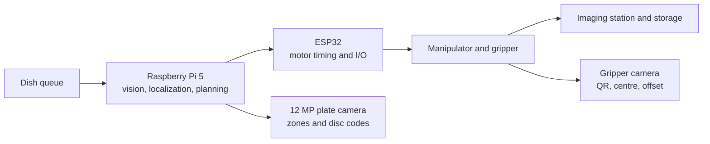

# System architecture

Companion to the [project README](../README.md). The revised ELD411 mid-term deck (September 2026) is the current architecture. The SCARA bill of materials in [`hardware/`](../hardware/) is the earlier procurement draft.

## Control split

The Pi estimates what and where. The controller executes when and how. Feedback runs again after grip, transfer, and release.

| Layer | Hardware in the draft | Responsibility |
|-------|------------------------|----------------|
| Intelligence | Raspberry Pi 5 | Vision, position estimate, high-level planning, CSI camera |
| Deterministic control | ESP32. Current sketches are Arduino. Zephyr is planned. | Motor timing, limits, command execution |
| Actuation | Drivers, motors, arm, end effector | Dish handling |
| Storage | Carousel or climate chamber, QR or barcode per slot | Hold the in-process queue (~600 dishes) |

Repository evidence for the controller is [`esp_codes/`](../esp_codes/): ESP32-CAM QR sketches and a stepper sketch. There is no Zephyr tree yet.

## Manipulator

The revised deck selects a 6-DOF arm and changes it for this cell:

| Change | Why |
|--------|-----|
| Longer links on the joints that reach the carousel | Stock reach does not cover the dish ring |
| Rigid camera above the gripper | One camera reads the QR and estimates dish centre and gripper offset |
| CSI and power routed through the motion | The camera cable has to survive the pick |
| Torque, stiffness, and collision recheck | Longer links change the loads |

Make-or-buy is recorded as open in the first deck (pre-built arm versus the custom SCARA in the BOM). The revised deck proceeds with the 6-DOF arm. Payload, reach, and the exact model stay blank until procurement is final.

Gripper-camera loop, from the revised deck:

1. Read the QR or barcode before pickup.
2. Estimate dish centre and the gripper offset.
3. Close the gripper at the corrected pose.
4. Confirm the dish moved. Retry if it did not.

## Imaging station

| Piece | Role |
|-------|------|
| 12 MP Camera Module 3 | Plate capture. Listed in the BOM. |
| Fixed working distance and diffused light | Repeatable calibration |
| 90 mm dish | Known diameter for millimetre scale |
| Optional XY stage | Tile if the optics target stays at 5 µm/pixel (~324 MP equivalent). See [hardware specs](01-hardware-specs.md). |

Two vision products come off the same photograph. They do not share a model.

| Part | Output | Code |
|------|--------|------|
| A. Circles | Dish boundary, disc centres, zone diameter | [`vision/petri_detect.py`](../vision/petri_detect.py) |
| B. Stamp | Antibiotic code and dose, any rotation | [`vision/antibiotic_vision/`](../vision/antibiotic_vision/) |

## Pick-and-place

Capture → detect dish → localize `x, y, θ` → camera-to-robot transform → collision-aware plan → approach → grip and confirm → transfer → release → verify.

Verification is part of the sequence so a missed grip becomes a retry or an operator escalation.

## Simulation

Planned path: CAD geometry → URDF → ROS 2 → Gazebo → sensor and joint control → pick-and-place trajectories.

The simulation is meant to check workspace reach, joint limits, trajectory feasibility, collisions, and the pick-place order before the arm is rebuilt. A 2× clip of the arm and carousel is in the [README](../README.md) (`assets/gazebo-sim-2x.mp4`). The URDF and Gazebo world are not in the repository yet.

## Still open

- Handoff timing between the arm and the imaging station.
- Whether zone imaging is one 12 MP frame or a tiled scan.
- Lighting placement and diffusion.
- Lens fogging if the camera sits inside the humidity chamber.
- Final arm model, payload, and the link lengths after the reach change.
- A single entry point that runs disc detection and code reading on a new plate photo.

